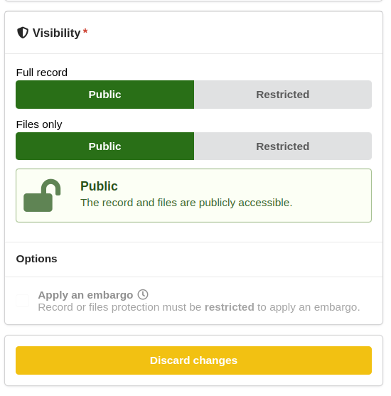
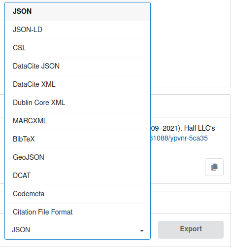

# Records

**Audience**: End-users

InvenioRDM gives you full control over your records.

## Deposit metadata-only records

A metadata-only record is a record that contains only descriptive metadata, and no associated files. These types of records can be useful in cases where the resource does not have a corresponding digital object or its files are hosted elsewhere.

The site administrator can choose to enable or disable the creation of metadata-only records. For more on that, see [this section](../operate/customize/metadata/metadata_only.md).

To mark a record as metadata-only, simply select the "Metadata-only record" checkbox when creating a new record:


## Restrict records

A record can be marked as restricted in order to restrict its access to specific users. This is useful for example to share a record with a colleague or team before making it public.

### Setting a record to be restricted

When creating or editing a record, click the "Restricted" checkbox under "Full record" in the "Visibility" section of the form to make the entire record -metadata and files- restricted:



To **only** make the files restricted, click the "Restricted" checkbox under "Files only" in the "Visibility" section.


## Request access to restricted files of a record

_Introduced in InvenioRDM v12_

You can allow authenticated and non-authenticated (guest) users to request access to view the restricted files of a public record. Access can be set to expire on a specific date as well as never expire.

This can be useful for record owners to manage access to restricted files of each record. For unauthorized users, it gives the possibility to request access to the files.

Note: accepted access requests grant to the requestor access to **all** versions of the record.

### Enable access requests

As a record owner, you first need to allow accessing restricted files via a request:

0. Create a record with restricted files

1. Click on the "Share" button on the record landing page:


2. Navigate to the "Settings" tab of the modal:


3. Change the settings for the access requests:

    * Allow authenticated or/and unauthenticated users to request access to restricted files of your record.
    * Accept conditions. Provide a message that will be visible to the users in the request form (see screenshot below)
    * Set access expiration date. This setting will be applied by default to all access requests. When reviewing an access request, you can set a different value.

4. Save your changes


Now both authenticated and anonymous users are able to **request** view access to your record’s files. You need to approve their request to grant them access to your record's files.

### Request access to restricted files

As a user that would like to get access to restricted files of a record, it is necessary to **fill in the request form** appearing in the record landing page. This action creates and submits a new access request: the record's owner will be notificed, and the request will appear on their respectives dashboards.

### Accepting/Declining the request

The submitter and the record's owner can find the newly created access request in "My dashboard" -> "Requests", and can exchange comments. The record's owner can define a new expiration date (changing the default settings) for this access request, accept or decline it:


After accepting the request, the requestor will receive a notification by e-mail and will be able to access the restricted files:


## Export records in different formats

_Introduced in v12.0.0_

InvenioRDM provides various record serialisation formats to let users easily export bibliographic records in a machine-readable way (to transfer them to different systems for instance). These formats adhere to widely used metadata standards such as DataCite, Dublin Core, BibTeX, ...

By providing a range of export formats, InvenioRDM empowers users to share and exchange metadata records with other systems in a format that is compatible with their respective standards. This makes it easier to ensure that metadata records are accurate, complete, and consistent across different systems.

A bibliographic record can be exported to a different format via the user interface (UI) or via the application programming interface (API):

### Via the UI

On the record landing page, use the `Export` dropdown menu ...


... and select the format you wish to export the record's metadata into.



### Via the API

Use the `Accept` header:

```
GET /api/records/ HTTP/1.1
Host: inveniordm.web.cern.ch
Accept: <export-format-mime-type>;charset=UTF-8
```

Find below the `Accept` header MIME type for each export format.

### JSON

The JSON export format in InvenioRDM exports metadata records in a structured JSON format, which includes all the metadata fields associated with the record, as well as any custom fields. This makes it possible to export metadata records from Invenio-app-rdm in a machine-readable format that can be used for a variety of purposes, such as data analysis, visualization, or integration with other software systems.

To export a metadata record in JSON format in InvenioRDM, users can simply select the "JSON" option from the export menu, which will generate a JSON file containing the record's metadata in the appropriate format. The JSON file can then be downloaded and used as needed.

To export a record via REST API to JSON format, use the `application/json` MIME type:

```shell
GET /api/records/ HTTP/1.1
Host: inveniordm.web.cern.ch
Accept: application/json;charset=UTF-8
```

### DataCite

The DataCite export format is a JSON and XML serialization of the DataCite internal data model. You can read more about the InvenioRDM data model <here - link to https://inveniordm.docs.cern.ch/reference/metadata/>.

The official documentation for the DataCite metadata schema can be found on their [website](https://schema.datacite.org/meta/kernel-4.4/).

To export a record to DataCite XML format, use the `application/vnd.datacite.datacite+xml` MIME type:

```shell
GET /api/records/ HTTP/1.1
Host: inveniordm.web.cern.ch
Accept: application/vnd.datacite.datacite+xml;charset=UTF-8
```

To export a record to DataCite JSON format, use the `application/vnd.datacite.datacite+json` MIME type:

```shell
GET /api/records/ HTTP/1.1
Host: inveniordm.web.cern.ch
Accept: application/application/vnd.datacite.datacite+json;charset=UTF-8
```

### DCAT-AP

DCAT-AP is a specification for describing public sector datasets and data services across Europe. It provides a common metadata vocabulary for describing datasets, catalogs, and services. The goal is to make it easier for users to find, access, and use data. DCAT-AP is based on the Data Catalog Vocabulary (DCAT) specification, which is maintained by the W3C.

The DCAT-AP data model is based on the Dublin Core metadata elements and includes additional properties for describing datasets and data services. It defines a core set of metadata elements that must be provided for each dataset, as well as optional and recommended elements. Some of the core elements include the title, description, publisher, and keyword.

Here is a link to the DCAT-AP data model (format) documentation: https://joinup.ec.europa.eu/collection/semantic-interoperability-community-semic/solution/dcat-application-profile-data-portals-europe.

To export a record to DCAT-AP format, use the`application/dcat+xml` MIME type:
```shell
GET /api/records/ HTTP/1.1
Host: inveniordm.web.cern.ch
Accept: application/dcat+xml;charset=UTF-8
```

### CSL

CSL (Citation Style Language) is a widely used XML-based format for defining citation styles used in academic writing. InvenioRDM provides CSL export format as a way to allow users to easily export metadata of their records in a citation format that can be used with various reference management software. This feature allows users to easily generate bibliographies and citations for their research work.

To export a record to CSL format, use the `application/vnd.citationstyles.csl+json` MIME type:

```shell
GET /api/records/ HTTP/1.1
Host: inveniordm.web.cern.ch
Accept: application/vnd.citationstyles.csl+json;charset=UTF-8
```

### MARCXML

MARCXML is an XML representation used to represent bibliographic records in the MARC 21 (MAchine Readable Cataloging) format, which is widely used in libraries for the description of bibliographic items. MARCXML includes a standard set of data elements, control fields, and subfields, each with its own tag and indicator values, that allow for the representation of bibliographic metadata.

Here's a link to the official documentation of the MARC 21 data model:
https://www.loc.gov/standards/marcxml/schema/MARC21slim.xsd

To export a record to MARCXML format, use the `application/marcxml+xml` MIME type:

```shell
GET /api/records/ HTTP/1.1
Host: inveniordm.web.cern.ch
Accept: application/marcxml+xml;charset=UTF-8
```

### BibTex

BibTeX is a bibliographic file format commonly used with LaTeX documents. It allows users to easily organize and manage bibliographic references in their documents. The BibTeX format uses a plain text file with a .bib extension and consists of entries, each describing a reference.

Each BibTeX entry starts with a @ symbol, followed by the type of reference (e.g., @article, @book, @inproceedings, etc.) and a unique identifier for the reference. The fields for each entry include the author(s), title, year, publisher, journal, and any other relevant information about the reference.

BibTeX is widely used in the academic community and is supported by many reference management software programs.

Here's a link to the BibTeX documentation: https://www.bibtex.com/format/

To export a record to BibTex format, use the `application/x-bibtex` MIME type:

```shell
GET /api/records/ HTTP/1.1
Host: inveniordm.web.cern.ch
Accept: application/x-bibtex;charset=UTF-8
```

### Dublin Core

Dublin Core is a metadata standard used to describe digital resources such as web pages, images, and videos. It consists of a set of 15 metadata elements that provide basic descriptive information about a resource, including its title, creator, subject, description, publisher, and date. The elements can be used in a variety of combinations and can be extended to meet specific needs.

Dublin Core is widely used across many domains and is especially popular in the library and cultural heritage communities. It is a simple and flexible standard that allows for easy exchange and sharing of metadata between systems.

Here's a link to the Dublin Core Metadata Element Set specification: https://www.dublincore.org/specifications/dublin-core/dces/

Example search request:

```shell
GET /api/records/ HTTP/1.1
Host: inveniordm.web.cern.ch
Accept: application/x-dc+xml;charset=UTF-8
```

### GeoJSON

GeoJSON is a format for encoding geographic data structures using JSON. It supports various types of geometries such as points, lines, and polygons, and allows for additional properties to be associated with those geometries. GeoJSON is often used to exchange data between web services and to display geospatial data on web maps.

Here is a link to the official GeoJSON specification: https://datatracker.ietf.org/doc/html/rfc7946

To export a record to GeoJSON format, use the `application/vnd.geojson+json` MIME type:

```shell
GET /api/records/ HTTP/1.1
Host: inveniordm.web.cern.ch
Accept: application/vnd.geojson+json;charset=UTF-8
```
